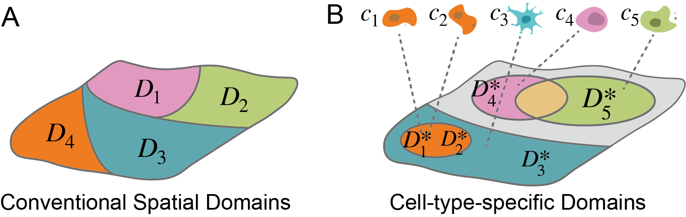
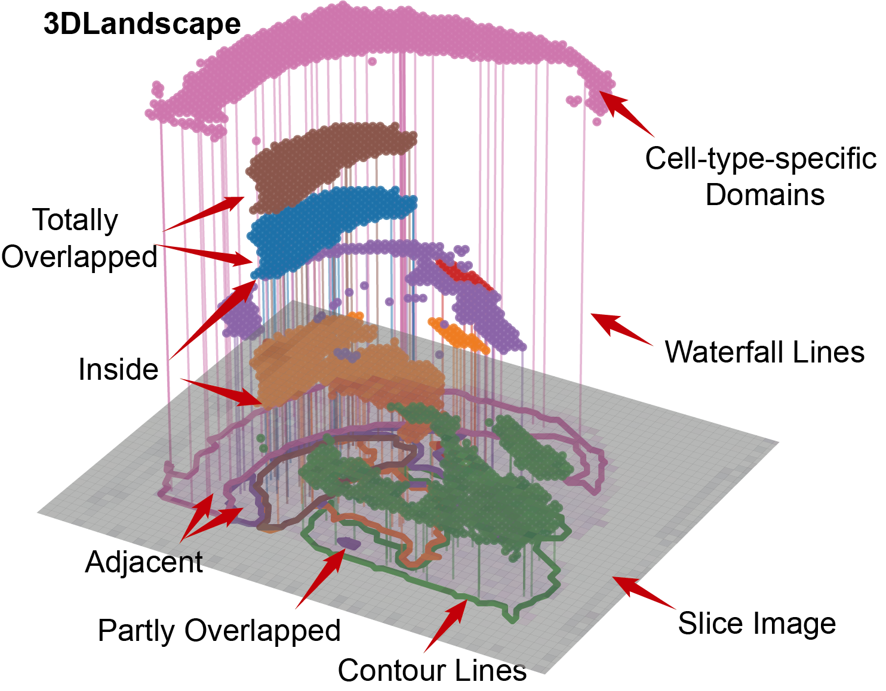

# Despot

### Summary

Cell-type-specific domains are the anatomical domains in spatially resolved transcriptome (SRT) tissues where particular cell types are enriched coincidentally. Precisely detecting these domains is essential for the biological understanding of tissue architectures and cell co-localizations. However, using existing computational methods is challenging to detect specific domains with low-proportion cell types, which are partly overlapped with or even inside other cell-type-specific domains. Here, we propose an approach called Despot that synthesizes segmentation and deconvolution as an ensemble to generate cell-type patterns, detect low-proportion cell-type specific domains, and display these domains intuitively. Experimental evaluation showed that Despot enabled us to discover the co-localizations between cancer-associated fibroblasts and immune-related cells that indicate potential tumor microenvironment (TME) domains in given slices, which was obscured by previous computational methods. We further elucidated the identified domains and found that Srgn may be a critical TME marker in SRT slices. By deciphering T-cell-specific domains in breast cancer tissues, Despot also revealed that the proportions of exhausted T cells were significantly more enormous in invasive than in ductal carcinoma. 


## Installation

Despot is implemented by Python 3.9.7 and R 4.1.3 (tested on Ubuntu 20.04, MacOS Catalina). 

**For Python 3.9:**

First we create a new virtual environment, and activate it. Then we install the basic python packages in `requirements.txt`

```shell
conda create --name Despot python=3.9
conda activate Despot
pip install -r requirements.txt
```

Time to install the requirements depends on the operating system.

**For R 4.1.3:**

Run this code in R Console for Despot basic requirements

```R
install.packages(c("BiocManager", "Matrix","stringr"))
BiocManager::install(c("rhdf5", "png", "rjson","data.table","SingleCellExperiment", "optparse", "distances", "gtools", "umap", "dplyr", "mvtnorm", "qvalue", "ComplexHeatmap", "tidyverse"))
```

## Usage

### Execution in Shell/Bash

We run the `main.py` to execute the configures in `/configs` using python:

```shell
python main.py
```

The required softwares will be installed automatically. Users also can install them manually using the URLs in `source.md `.  The smdFiles generated are stored in `h5smds`.

**Config Settings**

In default, we run the configures in `/configs`. Users can set their own configs with the guidance below:

```json
{
  "dataPath": "path/to/your/SRT data/input",
  "imgPath": "path/to/your/image/input under dataPath",
  "platform": "10X_Visium",  /*10X_Visium, ST, Slide-seq*/	
  "dataSpices": "Human",	/*Human, Mice*/
  "name": "your_sample_name",
  "filter_matrix": true,  /*Whether the matrix is filtered*/
  "smdFile": "path/to/output/smdFiles",
  "ground_truth": "metadata.csv", /*SRT ground truth file*/
  "ground_name": "ground_truth", /*SRT ground truth name*/
  "scDataPath": "path/to/your/single-cell data/input",
  "scType": "Any", /*Any, tsv, mtx, txt, h5ad*/
  "scBarcodes": "count_matrix_barcodes.tsv",
  "scFeatures": "count_matrix_genes.tsv",
  "scMatrix": "count_matrix_sparse.mtx",
  "scGroundTruth": "metadata.csv",
  "scGroundName": "celltype_minor",
  "load_hires": true,
  "load_fullres": false,
  "fullres_path": "path/to/your/fullres_datapath",
  "Decontamination": ["none","SPCS","SpotClean", "SPROD"...],
  "Clustering": ["BayesSpace", "SpaGCN", "leiden", "stlearn", "SEDR"...],
  "Deconvolution": ["CARD","Cell2Location","SPOTlight", "spacexr","StereoScope"...],
}
```

Despot will load these configs first, check for the environments, and run for outputs in smdFiles.

## Description

### Cell-type-specific Domains

Conventional spatial domains are expected to have high intra-cluster similarity within each domain and low inter-cluster similarity between different domains. Cell-type-specific domains are further expected to be spatial heterogenous domains where the proportions of given cell types are significantly higher than other domains. In addition, cell-type-specific domains is suitable for SRT slices in both spot-level and single-cell resolution. Formally, suppose the SRT slice contains n spots $S=\{s_1,s_2,…,s_n\}$ and single-cell profiles provide m potential cell types $C=\{c_1,c_2,…,c_m\}$. Each cell type $c_i$ is combined with its detected specific domain $D_i$ as a cell-type-specific domain tuple $(c_i,D_i)$, and the set of all these tuples is denoted as $\mathcal{D}_{cts}$.

$$\mathcal{D}_{cts}=\{(c_i,D_i )|i∈\{1,2,…,m\},c_i∈C,D_i⊆S\}$$

Cell-type-specific domains have two properties: (1) they allow existing $i≠j∈\{1,2,…,m\}$ such that $D_i∩D_j≠∅$ and (2) $\cup_{i=1}^mD_i ⊆S$. It means that a spot may belong to one or multiple cell-type-specific domains, meanwhile some spots are not encompassed by any cell-type-specific domains. For the detection of cell-type-specific domain tuple $(c_i,D_i )∈\mathcal{D}_{cts}$ , let $M$ denote the difference in the proportion of $c_i$ between $D_i$ and other domains.

$$M=\frac{\sum_{s∈D_i}P(s,c_i )}{|D_i|} -\frac{\sum_{s∈S\setminus D_i}P(s,c_i )}{|S|-|D_i |},0<|D_i |<|S|$$

Here, $P(s,c_i )$ denotes the cell proportions of $c_i$ within spot $s$ in spot-level slices. In single-cell level SRT slices, $P(s,c_i )$ denotes the probability that the ground truth cell type of spot $s$ is $c_i$. $P(s,c_i )∈[0,1]$, $M∈[-1,1]$. The cell-type-specific domain $D_i$ is optimized to be spatially heterogeneous and have the maximization of $M$.

Compared with conventional domains, cell-type-specific domains mainly focus on the location of potential cell types and relax restrictions on regional segmentation. Here is an example:




Figure 1A, conventional spatial domains separate the tissue into $D_1$ , $D_2$, $D_3$ and $D_4$. Each pair of them has no overlaps. Figure 1B, the specific domains of cell-type $c_1$, $c_2$, $c_3$, $c_4$ and $c_5$ are identified as $D_1^*,D_2^*,D_3^*,D_4^*,D_5^*$. In particular, the $D_1^*$ specific domain is totally overlapped with D2, and they are inside the  $D_3^*$ specific domain. The $D_4^*$ specific domain is partly overlapped $D_5^*$, and their overlapped domain is marked by yellow.


### Despot Algorithm

Despot aims to precisely detect cell-type specific domains in sequencing-based spatial transcriptomics data via ensemble learning. We developed a data representation called *smd* as the core data structure of Despot. In addition to spatial modalities analysis, Despot provides a variational inference module to derive single-cell patterns. Despot integrates several segmentation and deconvolution methods as an ensemble to detect cell-type-specific domains in the modality integration module. After detecting cell-type-specific domains, Despot examines the upregulated genes of these domains, deciphers the cell-type co-localizations, and finally visualizes them using 3D landscapes.


### Data Representation

Despot designs a spatial multi-omics data representation format called *smd* based on HDF5 binary data. A *smd* file has interfaces with Python and R infrastructures, containing *spContexts* and a series of *scMatrixs* and *spMatrixs*, whose core matrices are column compressed. 


### 3D Landscape

Despot designs 3D landscapes to display the detected cell-type-specific domains. The generated landscapes curve the outlines of cell-type-specific domains in tissues and display the overlapped domains in layered structures. Despot uses the Alpha-shape algorithm to curve the contour lines in tissues and uses dots with colors to represent the layers of cell-type-specific domains. To map the layered structures onto contour lines, Despot randomly selects dots of 10 percent for each layer and creates waterfall lines to link the dots and outlined regions together. 3DLandscapes can be displayed using the function `Show_3DLandscape`, which receives an output SMD file from Despot. Here is an example:



**Figure 3**. A demo of a 3D Landscape, corresponding to Figure S1C. Key elements like cell-type specific domains, slice images, waterfall lines, contour lines, and co-localization statuses are marked out by red arrays. Slice Image is at the bottom of the 3D Landscape, contour lines are drawn in the slice image. Cell-type-specific domains are plotted in hierarchical layers, which are linked with contours in the slice image by the waterfall lines. The 3D landscape intuitively displays the cell co-localization status. In particular, domain brown and domain blue are totally overlapped, domain blue is inside the domain yellow, domain purple and domain green are partly overlapped, and domain pink is adjacent to domain purple. 

## APIs & Tutorials

### Despot

Despot begins with three inputs: (1) a spatial expression matrix of unique molecular identifier (UMI) counts, (2) the accompanying spatial coordinates and images, and (3) a single-cell (single-nucleus) gene-expression profile with annotations that are configured in a JSON file.

##### APIs in one-stop

**SMD_init(smdFile, force)**: Initialize the SMD File.

- **smdFile** (str/os.Path), Path to the SMD File.
-  **force** (bool, default: `False`), If it is set to `False`, initialization will be skipped when smdFile already exists, and if it is set to `True`, initialization will be forced.
- **Return:** `None`

**SMD_check_corrections(smdFile)**: Checking the correction of SMD File.

- **smdFile** (str/os.Path), Path to the SMD File.

**Save_smd_from_configs (smdFile, cfg_file, items, change_cfg)**: Saving configs to SMD File after initialization. 

- **smdFile** (str/os.Path), Path to the SMD File.
- **cfg_file** (str/os.Path), Path to the config File.
- **items** (dict/None), Config items to store in SMD File.
- **change_cfg** (bool, default: `False`), Whether enable configs to change using **items**.

**Despot_Run(smdFile)**: Run Despot in one-stop. This function integrated all the Despot APIs as a workflow.

- **smdFile** (str/os.Path), Path to the SMD File.
- **Return:** `None`

##### APIs step-by-step

**In utils/api.py:**

**Despot_Decont(smdFile, cfg, force)**: Generating preprocessed and decontaminated `spMatrix`.

- **smdFile** (str/os.Path), Path to the SMD File.
- **cfg** (dict), config of Despot, from `params.json`. This function loads the `decontamination` members in the configs, which accept `["none", "SPCS", "SpotClean", "SPROD"] `.
-  **force** (bool, default: `False`), If it is set to `False`, decontamination will be skipped when decontamination results already exist, and if it is set to `True`, decontamination will be forced.
- **Return:** `None`

**Despot_Cluster(smdFile, cfg, force)**: Generating spatial domain candidates from different `spMatrix`.

- **smdFile** (str/os.Path), Path to the SMD File.
- **cfg** (dict), config of Despot, from `params.json`. This function loads the `cluster` members in the configs, which accept `["Seurat", "Giotto", "BayesSpace", "SpaGCN", "leiden", "stlearn", "SEDR", "BASS", "MENDER", "Squidpy"] `.
-  **force** (bool, default: `False`), If it is set to `False`, clustering will be skipped when spatial domain candidates already exist, and if it is set to `True`, clustering will be forced.
- **Return:** `None`

**Despot_Deconv(smdFile, cfg, force)**: Generating single-cell patterns in `scMatrix` and cell-type proportion candidates from different `spMatrix`.

- **smdFile** (str/os.Path), Path to the SMD File.
- **cfg** (dict), config of Despot, from `params.json`. This function loads the `deconvolution` members in the configs, which accept `["CARD", "Seurat", "Giotto", "Cell2Location", "SPOTlight", "SPOTlight_es", "SPOTlight_vae", "spacexr", "spacexr_es", "StereoScope", "StereoScope_na", "StereoScope_es"] `.
-  **force** (bool, default: `False`), If it is set to `False`, deconvolution will be skipped when cell-type proportion candidates already exist, and if it is set to `True`, deconvolution will be forced.
- **Return:** `None`

**Despot_Embedding(smdFile, cfg)**: Correcting batch effects and generating integrated reductions.

- **smdFile** (Union[str, List[str]]), Path or Path list to the SMD File.
- **cfg** (Union[dict, List[dict]]), config or config list of Despot, from `params.json`. 
- **Return:** `None`

**Despot_Ensemble(smdFile)**: Generating cell-type-specific domains.

- **smdFile** (str/os.Path), Path to the SMD File.
- **Return:** `None`

### SMD Format

#### In Python Environment

**Load_smd_to_AnnData(smdFile, h5data, hires, loadDeconv, loadReduction, loadImg, platform, dtype)** Loading `spMatrix` in SMD File to AnnData in Python environment.

- **smdFile** (Union[str, List[str]]), Path or path list to the SMD File.
- **h5data** (str, default: `matrix`), `spMatrix` to load for AnnData.
-  **hires** (bool, default: `False`), Whether loading high-resolution image to AnnData.
- **loadDeconv** (bool, default: `False`), Whether to load cell-type proportion candidates to AnnData.
- **loadReduction** (bool, default: `False`), Whether to load integrated reductions to AnnData.
- **loadImg** (bool, default: `True`), Whether loading image to AnnData.
- **platform** (str, default: `10X Visium`), The SRT sequencing platform.
- **dtype** (str, default: `"float32"`), Data type of `spMatrix`.
- **Return:** `ad.AnnData`

**Load_smdsc_to_AnnData (smdFile, h5data)** Loading `scMatrix` in SMD File to AnnData in Python environment.

- **smdFile** (Union[str, List[str]]), Path or path list to the SMD File.
- **h5data** (str, default: `scRNA_seq`), `scMatrix` to load for AnnData. Options:`['scRNA_seq', 'scRNA_seq-es', 'scRNA_seq-vae']`
- **Return:** `ad.AnnData`

**Load_smd_to_stData** Loading `spMatrix` in SMD File to stData in Python environment. (Parameters are  same as **Load_smd_to_AnnData**)

#### In R Environment

**Load_smd_to_Seurat <- function (smdFile, platform, h5data)** 

- **smdFile** (characters), Path, or path list to the SMD File.
- **platform** (characters, default: `10X Visium`), The SRT sequencing platform. Options: `['10X_Visium', 'ST', 'Stereo-seq', 'MERFISH', 'Slide-seq', 'osmFISH']`
- **h5data** (characters, default: `matrix`), `spMatrix` to load for `SeuratObject`.  Options:`['matrix', 'SPCS_mat', 'SpotClean_mat', 'SPROD_mat']`
- **Return:** `SeuratObject`

**Load_smd_to_SCE <- function (smdFile, platform, h5data)** 

- **smdFile** (characters), Path, or path list to the SMD File.
- **platform** (characters, default: `10X Visium`), The SRT sequencing platform. Options: `['10X_Visium', 'ST', 'Stereo-seq', 'MERFISH', 'Slide-seq', 'osmFISH']`
- **h5data** (characters, default: `matrix`), `spMatrix` to load for `SingleCellExperiment`. Options: `['matrix', 'SPCS_mat', 'SpotClean_mat', 'SPROD_mat']`
- **Return:** `SingleCellExperiment`

**Load_smd_to_SE <- function (smdFile, platform, h5data)** 

- **smdFile** (characters), Path, or path list to the SMD File.
- **platform** (characters, default: `10X Visium`), The SRT sequencing platform. Options: `['10X_Visium', 'ST', 'Stereo-seq', 'MERFISH', 'Slide-seq', 'osmFISH']`
- **h5data** (characters, default: `matrix`), `spMatrix` to load for `SpatialExperiment`. Options: `['matrix', 'SPCS_mat', 'SpotClean_mat', 'SPROD_mat']`
- **Return:** `SpatialExperiment`

**Load_smd_to_Giotto <- function (smdFile, platform, h5data)** 

- **smdFile** (characters), Path, or path list to the SMD File.
- **platform** (characters, default: `10X Visium`), The SRT sequencing platform. Options: `['10X_Visium', 'ST', 'Stereo-seq', 'MERFISH', 'Slide-seq', 'osmFISH']`
- **h5data** (characters, default: `matrix`), `spMatrix` to load for `GiottoObject`. Options: `['matrix', 'SPCS_mat', 'SpotClean_mat', 'SPROD_mat']`
- **Return:** `GiottoObject`

**Save_smd_from_Idents <- function (smdFile, arr, title, h5data = 'matrix')**

- **smdFile** (characters), Path, or path list to the SMD File.
- **arr** (characters[]), 1D-array idents to save in the SMD File.
- **title** (characters), Title of idents to save in the SMD File.
- **h5data** (characters, default: `matrix`), `spMatrix` to save. Options: `['matrix', 'SPCS_mat', 'SpotClean_mat', 'SPROD_mat']`
- **Return:** `None`

**Save_smd_from_Deconv <- function (smdFile, deMatrix, title, h5data = 'matrix')**

- **smdFile** (characters), Path, or path list to the SMD File.
- **deMatrix** (matrix/unpackedMatrix), 2D-array deconvolution matrix to save in the SMD File.
- **title** (characters), Title of deconv to save in the SMD File.
- **h5data** (characters, default: `matrix`), `spMatrix` to save. Options: `['matrix', 'SPCS_mat', 'SpotClean_mat', 'SPROD_mat']`
- **Return:** `None`

**Save_smd_from_Reduct <- function (smdFile, reduct, title, h5data = 'matrix')**

- **smdFile** (characters), Path, or path list to the SMD File.
- **deMatrix** (matrix/unpackedMatrix), 2D-array reduction matrix to save in the SMD File.
- **title** (characters), Title of reduction to save in the SMD File.
- **h5data** (characters, default: `matrix`), `spMatrix` to save. Options: `['matrix', 'SPCS_mat', 'SpotClean_mat', 'SPROD_mat']`
- **Return:** `None`

**Save_smd_from_spMat <- function (smdFile, spMat, title)**

- **smdFile** (characters), Path, or path list to the SMD File.
- **spMat** (matrix/dgCMatrix), 2D denoised/preprocessed expression matrix to save in the SMD File.
- **title** (characters), Title of spMat to save in the SMD File.
- **Return:** `None`

### 3D Landscape

**in utils/geo.py:**

**Show_3D_landscape(smdFile, folder, cell_types, sf, pipline=None, imgPath=None,  alpha=100,  save=True,  plot_edge=True,  name="landscape.png",  legend=True)**

- **smdFile** (Union[str, List[str]]), Path, or path list to the SMD File.
- **folder** (str/os.Path, default: os.getcwd()), Folder to save 3DLandscape images.
- **cell_types** (Union[str, List[str], None]), List of cell types to display in 3DLandscape. If it is `None`, all cell types will be displayed.
- **pipline** (Union[str, None] default: `None`), Show 3DLandscape for other pipelines. Options: `['Seurat', 'Giotto', 'CARD']`.If it is `None`, 3DLandscape for Despot will be displayed.
- **imgPath** (Union[str, None], default: `None`), Path to Slice image. If it is `None`, image in SMD File will be loaded. 3DLandscape sets the largest domain to the bottom layer and hides the contour lines if no images are in the SMD file.
- **alpha** (int, default: 100), Alpha params for drawing contour lines. The greater the value of Alpha, the more distinct or pronounced the contour lines become.
- **save** (bool, default: `True`), Whether to save image.
- **plot_edge** (bool, default: `True`), Whether to plot contour lines in the slice image.
- **name** (str, default: `'landscape.png'`), Name of 3DLandscape images. The DPI is set to 300 for `PNG`, and `JPEG` files. 
- **legend** (bool, default: `True`), Whether to show legends.
- **Return:** dict(pd.DataFrame['x', 'y', 'z']), Returns the spots coordinates of cell types in 3DLandscapes.

### Tutorials

For config settings and API usages, see more details in a demo: `./expr/PDAC/PDAC-A.ipynb`.
